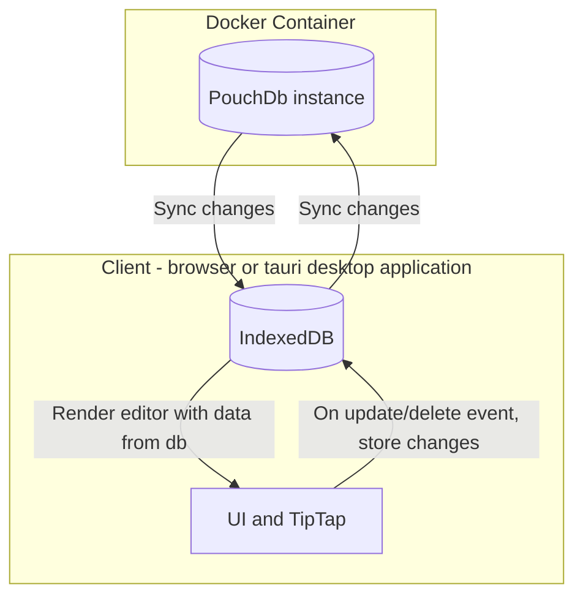

# notes

A minimal note-taking application for Linux, Mac, Windows, and browsers. Supports cloud syncing through [PouchDb](https://pouchdb.com/)

## TODOs

- Separate build process + deployment of browser-only version and desktop version
- PouchDb remote
  - make it work + update readme with work (separate repo for docker container?)
- Tauri version: supports auto-updates
- Basic unit tests run on push + on PR

## Application Architecture

Goal: keep the application as simple to use and maintain as possible. Leverage existing technologies when possible and strictly vet each dependency.

Decisions for simplicity:

- Two main dependencies: PouchDb (cloud-enabled database) and TipTap (word processor)
- Pure Javascript instead of a UI framework. The application works as a light wrapper around TipTap to connect the database and writing editor states
- Using the [Proxy](https://developer.mozilla.org/en-US/docs/Web/JavaScript/Reference/Global_Objects/Proxy) approach for global state across components

### Database Docker Container

PouchDb works locally using the browser's [IndexedDB](https://developer.mozilla.org/en-US/docs/Web/API/IndexedDB_API) and in the cloud using [CouchDb](https://couchdb.apache.org/). This repo contains instructions and a docker container for setting up a remote PouchDb instance.

### Application structure and data-flow

This structure allows for multiple clients to stay in-sync.



## TODO ci/cd

On a PR commit/before push to main:

(goal is to run 1 action at a time to reduce usage as much as possible)

- run TypeScript type checker
- if it passes THEN
- run all unit tests
- if it passes THEN
- trigger test builds for the PR before merging
- if those pass
- then good to merge to main and trigger full release action

# Development

For developing Notes locally

## Software to install

- [Tauri](https://tauri.app/)
- [pnpm](https://pnpm.io/)
- [docker-compose](https://github.com/docker/compose) (only for running the docker container)

## getting up and running

TODO: commands for a fresh install

- required packages

### with docker db

info on couchdb w/ docker: https://github.com/apache/couchdb-docker

Running docker-compose.yml to run local db:

```
docker-compose up -d
```

To interact with the CouchDB server and databases while running the container, go to: `http://localhost:5984/_utils/` to open the GUI. Username and password are located in `docker-compose.yml`

## Updating packages

### Client

`pnpm i` from root

### Tauri/Rust Cargo packages

```
cd src-tauri
cargo update
```

# credits: Remix Icons

(before releasing app, need to properly share the license)
https://remixicon.com/license
