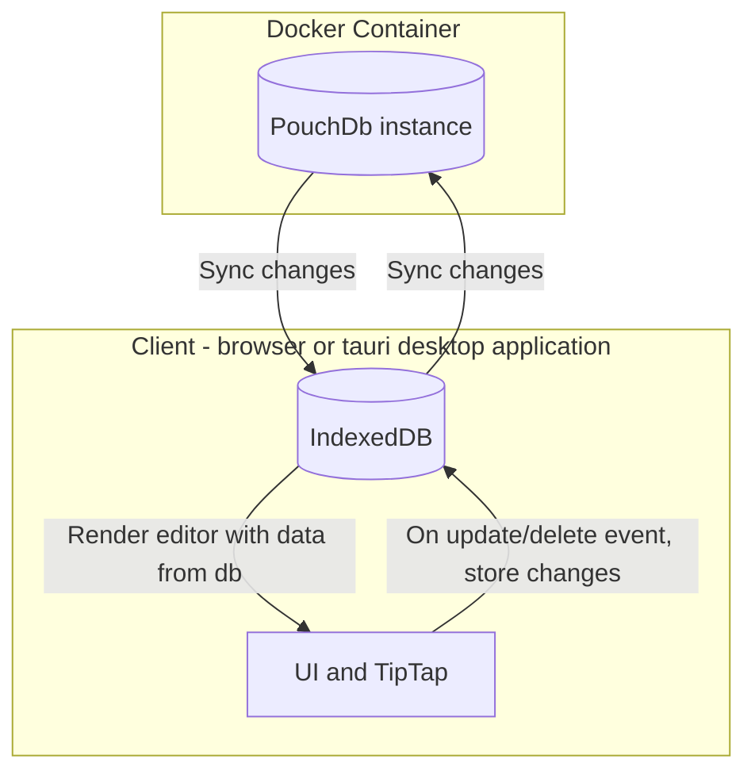

# notes

A minimal note-taking application for Linux, Mac, Windows, and browsers. Supports cloud syncing through [PouchDb](https://pouchdb.com/)

INSERT IMAGE OF APPLICATION HERE

## TODOs

- Separate build process + deployment of browser-only version and desktop version
- PouchDb remote
  - make it work + update readme with work (separate repo for docker container?)
- Tauri version: supports auto-updates
- Basic unit tests run on push + on PR

## Application Architecture

Goal: keep the application as simple to use and maintain as possible. Leverage existing technologies when possible and strictly vet each dependency.

Decisions for simplicity:

- Two main dependencies: PouchDb (cloud-enabled database) and TipTap (word processor)
- Pure Javascript instead of a UI framework. The application works as a light wrapper around TipTap to connect the database and writing editor states
- Using the [Proxy](https://developer.mozilla.org/en-US/docs/Web/JavaScript/Reference/Global_Objects/Proxy) approach for global state across components

### Database Docker Container

PouchDb works locally using the browser's [IndexedDB](https://developer.mozilla.org/en-US/docs/Web/API/IndexedDB_API) and in the cloud using [CouchDb](https://couchdb.apache.org/). This repo contains instructions and a docker container for setting up a remote PouchDb instance.

### Application structure and data-flow

This structure allows for multiple clients to stay in-sync.



# Development

For developing Notes locally

## Software to install

- [pnpm](https://pnpm.io/)
- [Tauri](https://tauri.app/)
- [docker-compose](https://github.com/docker/compose) (only for running the docker container)

## getting up and running

After the above software has been installed, from the root, run:

```bash
pnpm i
```

### with the docker container couchdb

Using the [couchdb-docker](https://github.com/apache/couchdb-docker) image

To run `docker-compose.yaml`, from the project's root, run:

```bash
docker-compose up -d
```

This will setup the container and the basic admin user and password.

To interact with the CouchDB server and database while running the container, go to: `http://localhost:5984/_utils/` to open the GUI. Username and password are located in `docker-compose.yaml`

### Updating Tauri/Rust Cargo packages

```
cd src-tauri
cargo update
```

# credits: Remix Icons

(before releasing app, need to properly share the license)
https://remixicon.com/license
