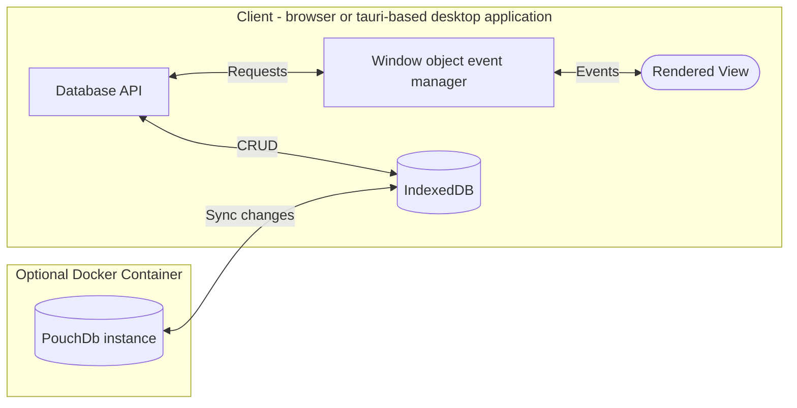

# notes

A minimal note-taking application for Linux, Mac, Windows, and browsers. Supports cloud syncing through [PouchDb](https://pouchdb.com/). For a simple, self-hosted remote database setup, see the [couchdb-docker repo](https://github.com/ste163/couchdb-docker).

TODO: INSERT IMAGE OF APPLICATION HERE

## TODOs

- Basic unit tests run on push + on PR
- Cleanup missing features and bugs (listed in index.ts)
- Test Tauri version: supports auto-updates

## Application Architecture

### Goal

Keep the application as simple and easily maintainable as possible by leveraging only a handful of well-maintained dependencies.

### Decisions for simplicity

- Two main dependencies: [PouchDB](https://pouchdb.com/) (database) and [TipTap](https://tiptap.dev/) (word processor and main state manager).
- Pure Javascript frontend instead of a UI framework. Because there are so few states to keep track of, I'm using event-based rendering to handle the small amount of states. TipTap handles the majority of the application state (as it is the word processor), so using a framework like React is unnecessary at this point. The main events are related to CRUD and handling database connections, which are small enough for a hand-rolled solution.

### Cloud syncing support

PouchDb works locally using the browser's [IndexedDB](https://developer.mozilla.org/en-US/docs/Web/API/IndexedDB_API) or remotely using [CouchDB](https://couchdb.apache.org/). A separate repo contains all the information for setting up the remote CouchDB server specifically for this application use: [couchdb-docker](https://github.com/ste163/couchdb-docker).

### Application data flow

This application structure allows for real-time data syncing and a React/SPA-like user experience but with pure Javascript.



# Local development setup

## Install

- [pnpm](https://pnpm.io/)
- [Tauri](https://tauri.app/) (follow their setup instructions)

From the project's root, run:

```bash
pnpm i
```

After installation is complete, start the application with

```bash
# Run only the UI for the browser
pnpm start:dev:ui
```

or

```bash
# Run desktop application through tauri
pnpm start:dev:tauri
```

### Updating Tauri/Rust Cargo packages

```
cd src-tauri
cargo update
```

# credits: Remix Icons

(TODO: before releasing app, need to properly share the license)
https://remixicon.com/license
