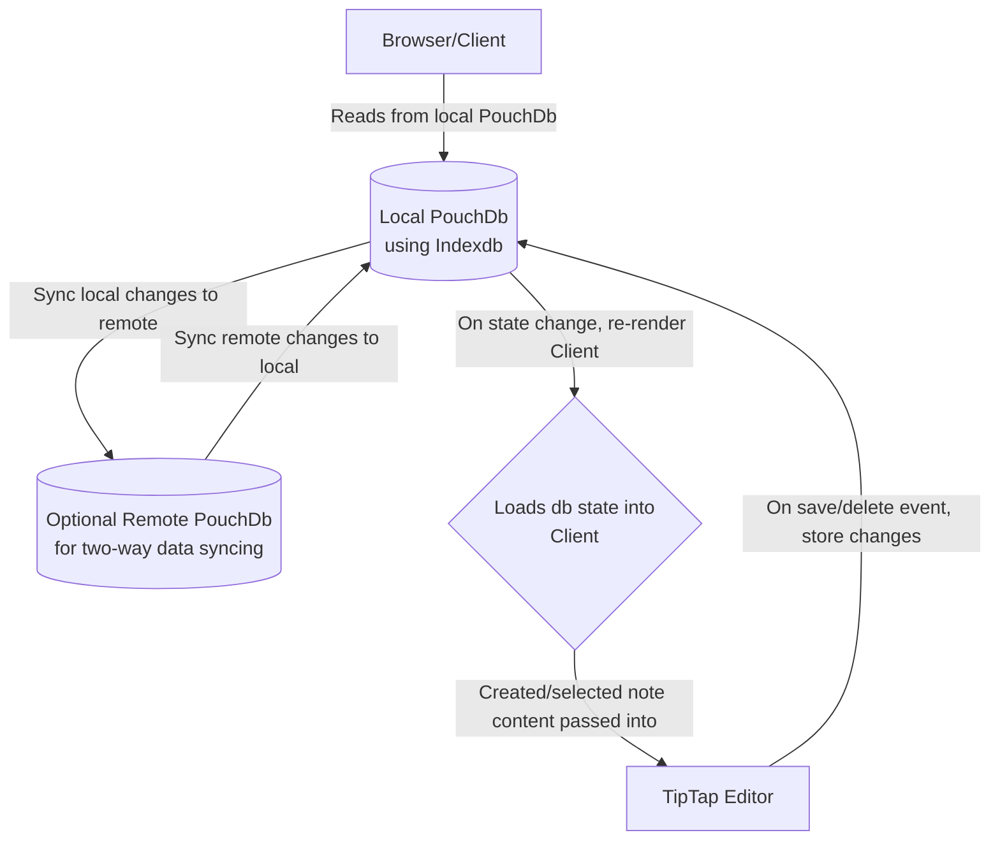

# untitled-notes-app

Vanilla JS notes app using PouchDb for local and remote data storage

As a desktop app using Tauri or on the browser

## TODOs

- Build process for Tauri
- Separate build process + deployment of browser-only version
- Tauri version
  - supports auto-updates
- Dev workflow
  - on pre-commit, run type checker
  - on pre-commit, run eslint config + formatting
  - basic unit tests run on push + on PR?
- PouchDb remote
  - make it work + update readme

## Architecture

This application uses vanilla HTML & Javascript (TypeScript) to keep the UI as easily maintainable as possible with as few as possible dependencies to upkeep. Keeping up with multiple dependencies becomes a major time commitment that I want to avoid. This application is built to be as simple as possible.

Decisions for simplicity:

- Two main dependencies: PouchDb and TipTap (the Editor)
- The UI always renders the exact state from PouchDb
- TipTap is utilized for the main interactivity
- When a state-change occurs, the client is re-rendered with the latest data

By going with this approach, the App's goal is to seamlessly connect PouchDb note state and the writing Editor's state.

The UI contains a note list and mechanics for creating, selecting, and deleting notes. Everything related to having an excellent writing experience is handled by TipTap.

(TODO) For portability, this repo contains a docker container for setting up a remote PouchDb with instructions

### Flow chart on the data flow



## TODO github action flow (if there were tests)

- on a PR commit/before push to main
- run TypeScript type checker
- if it passes
- run all unit tests
- if it passes
- trigger test builds for the PR before merging
- if those pass
- (ideally, we'd install the built app and run a suite of smoke tests on it)
- then good to merge to main and trigger full release action

## Dev requirements

- (link to tuari requirements)
- pnpm
- docker-compose

## getting up and running

todo: commands to get started

- required packages

### with docker db

info on couchdb w/ docker: https://github.com/apache/couchdb-docker

Running docker-compose.yml to run local db:

```
docker-compose up -d
```

To interact with the CouchDB server and databases while running the container, go to: `http://localhost:5984/_utils/` to open the GUI. Username and password are located in `docker-compose.yml`

## updating packages

### pnpm

`pnpm i` from root

### Rust Cargo packages

```
cd src-tauri
cargo update
```

# credits: Remix Icons

(before releasing app, need to properly share the license)
https://remixicon.com/license
