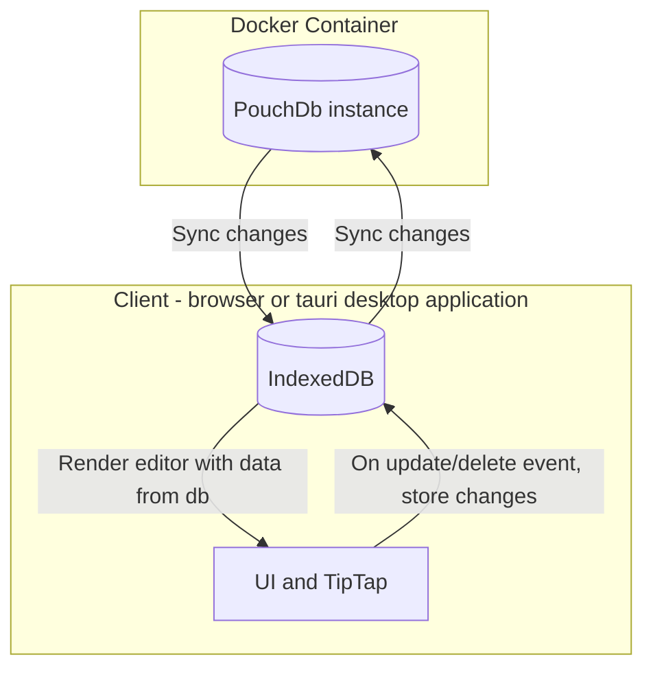

# notes

A minimal note-taking application for Linux, Mac, Windows, and browsers. Supports cloud syncing through [PouchDb](https://pouchdb.com/). For a simple, self-hosted remote database setup, see the [couchdb-docker repo](https://github.com/ste163/couchdb-docker).

TODO: INSERT IMAGE OF APPLICATION HERE

## TODOs

- Cleanup missing features and bugs (listed in index.ts)
- properly credit remix icons
- Tauri version: supports auto-updates
- Basic unit tests run on push + on PR

## Application Architecture

### Goal

Keep the application as simple and easily maintainable as possible. Leverage only a handful of well-vetted dependencies.

### Decisions for simplicity

- Two main dependencies: [PouchDB](https://pouchdb.com/) and [TipTap](https://tiptap.dev/) (word processor).
- Pure Javascript frontend instead of a UI framework. The application works as a light wrapper (a note list for selecting the active note) around TipTap to connect the database and writing editor states. Because TipTap handles the main UI state, including a major framework like Vue or React is not necessary yet.
- Using the [Proxy](https://developer.mozilla.org/en-US/docs/Web/JavaScript/Reference/Global_Objects/Proxy) approach for global state across components.

### CouchDB Docker Container

PouchDb works locally using the browser's [IndexedDB](https://developer.mozilla.org/en-US/docs/Web/API/IndexedDB_API) or remotely using [CouchDB](https://couchdb.apache.org/). A separate repo contains all the information for setting up the remote CouchDB server: [couchdb-docker](https://github.com/ste163/couchdb-docker).

### Application structure and data-flow

This structure allows for multiple clients to stay in-sync.



# Local development setup

## Install

- [pnpm](https://pnpm.io/)
- [Tauri](https://tauri.app/) (follow their setup instructions)

## Run

From the project's root, run:

```bash
pnpm i
```

### Updating Tauri/Rust Cargo packages

```
cd src-tauri
cargo update
```

# credits: Remix Icons

(TODO: before releasing app, need to properly share the license)
https://remixicon.com/license
