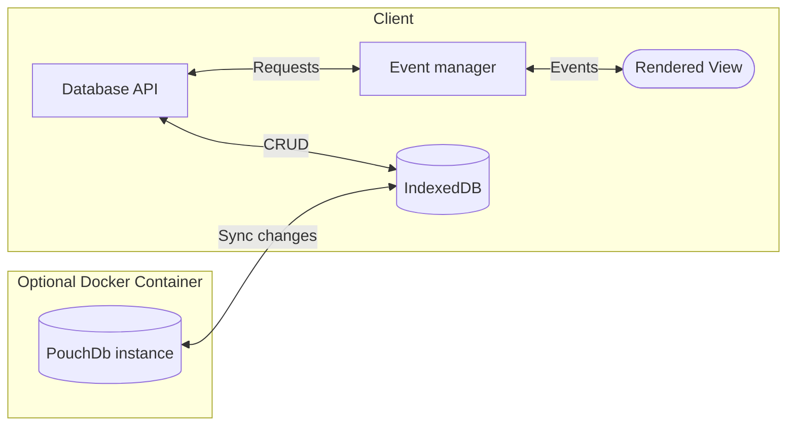

# notes

[](https://github.com/ste163/notes/actions/workflows/run-e2e.yml) [](https://github.com/ste163/notes/actions/workflows/run-unit-tests.yml)

A minimal note-taking application for Linux, Mac, Windows, and browsers. Supports cloud syncing through [PouchDB](https://pouchdb.com/). For a simple, self-hosted remote database setup, see the [couchdb-docker repo](https://github.com/ste163/couchdb-docker).

TODO: INSERT IMAGE OF APPLICATION HERE

## Web and Desktop versions

Notes uses the Tauri framework for desktop builds (and soon to be Android). Until Tauri v2's release, I will not be developing the desktop-specific features as v2 will include API changes.

Once Tauri v2 releases, Notes will support:

- Auto updates
- Keyboard shortcuts
- Linux, Mac, Windows, and Android

## Application Architecture

### Goal

Keep the application as simple and easily maintainable as possible by leveraging only a handful of well-maintained dependencies.

### Package decisions

- Two main dependencies: [PouchDB](https://pouchdb.com/) (database with remote-syncing) and [TipTap](https://tiptap.dev/) (word processor and main state manager).
- Pure Javascript frontend instead of a UI framework (because they update way too often). TipTap handles the majority of the application state (as it is the word processor), so using a framework like React, Vue, or Svelte is unnecessary at this point. The main events are related to CRUD and handling database connections, which are few enough that a hand-rolled solution has been easier to work with and keep updated (but we'll see for how long).

### Remote (cloud) syncing support

PouchDB works locally using the browser's [IndexedDB](https://developer.mozilla.org/en-US/docs/Web/API/IndexedDB_API) or remotely using [CouchDB](https://couchdb.apache.org/). A separate repo contains all the information for setting up the remote CouchDB server, specifically for Notes: [couchdb-docker](https://github.com/ste163/couchdb-docker).

### Application data flow

This application structure allows for real-time data syncing and a SPA-like user experience but with pure Javascript.



# For development

## Installation

- [pnpm](https://pnpm.io/)
- [Tauri](https://tauri.app/) (follow their setup instructions)

From the project's root, run:

```bash
pnpm i
```

### Running

```bash
# Run only the UI for the browser
pnpm start:dev:ui:web
```

or

```bash
# Run desktop application through Tauri
pnpm start:dev:tauri
```

### Updating Tauri/Rust Cargo packages

```
cd src-tauri
cargo update
```

### Commits to `main`

- Trigger re-build of Github Pages
- Trigger Tauri build
